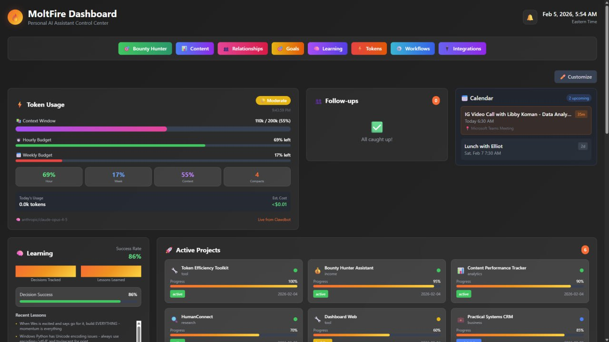

# OpenClaw Dashboard

A beautiful, real-time dashboard for monitoring your AI agent's activity. Built for the OpenClaw/Clawdbot/Clawd ecosystem. Includes improved memory and security focused tools.

   



*Your AI agent's command center - token tracking, learning insights, project status, calendar, and more.*

## 🚀 One-Click Deploy

[](https://vercel.com/new/clone?repository-url=https://github.com/ucsandman/OpenClaw-OPS-Suite&env=DATABASE_URL&envDescription=Your%20Neon%20PostgreSQL%20connection%20string&envLink=https://console.neon.tech)

**New to this?** Check out our [Quick Start Guide](QUICK-START.md) - no coding required!

**Already deployed?** Visit `/setup` for a guided walkthrough!

## Features

### 🧠 Memory & Ops Tools

- 🎯 **Token Budget Tracking** — Monitor usage with visual charts
- 📊 **Learning Database** — Track decisions, lessons, and outcomes over time
- 🤝 **Relationship Tracker (Mini‑CRM)** — Contacts, interactions, and follow‑up reminders
- 🎯 **Goal Tracking** — Goals, milestones, and progress
- 📝 **Content Tracker** — Capture writing ideas and content workflows
- 🧰 **Workflows / SOPs** — Document repeatable processes and runbooks

### 🔐 Security Tools

- 🔐 **Secure Settings Store** — Credentials encrypted and stored in your database
- 🧪 **Connection Tests** — Verify integrations before saving
- 🔍 **Security Scanner** — Pre‑deploy audit script (`node scripts/security-scan.js`)
- ✅ **Security Checklist** — Quick safe‑deploy reference (`docs/SECURITY-CHECKLIST.md`)
- 🧾 **Audit Template** — Full production audit methodology (`docs/SECURITY-AUDIT-TEMPLATE.md`)

### ⚡ Platform & UX

- 🔌 **Integrations Settings** — Configure services from the UI
- 📅 **Calendar Integration** — Upcoming events at a glance
- 🔄 **Real‑time Updates** — Auto‑refresh with configurable intervals
- 📱 **Mobile Responsive** — Works great on any device

## Quick Start

### 1. Set up your database

Create a free [Neon](https://neon.tech) PostgreSQL database. Run the schema from `docs/schema.sql` (coming soon).

### 2. Configure environment

```bash
cp .env.example .env.local
# Edit .env.local with your Neon connection string
```

### 3. Install and run

```bash
npm install
npm run dev
```

Open [http://localhost:3000](http://localhost:3000) 🎉

## Deployment

### Vercel (Recommended)

1. Push to GitHub
2. Import in [Vercel](https://vercel.com)
3. Add `DATABASE_URL` environment variable
4. Deploy!

### Other platforms

Any platform supporting Next.js 15 will work. Just set the `DATABASE_URL` environment variable.

## Integrations Settings

Configure all your connected services directly from the dashboard:

1. Go to **Integrations** page
2. Click any service card to configure
3. Enter your API keys/credentials
4. Click **Test Connection** to verify
5. **Save Settings** stores encrypted in your Neon database

Supported integrations:
- 🗄️ Neon Database
- 📝 Notion
- 🐙 GitHub
- 🤖 OpenAI
- 🧠 Anthropic
- 🦁 Brave Search
- 🎙️ ElevenLabs
- 💬 Telegram
- 📅 Google Workspace
- ▲ Vercel
- 🐦 Twitter/X
- 🔥 Moltbook

## API Endpoints

All endpoints return JSON and support CORS.

| Endpoint | Description |
|----------|-------------|
| `/api/settings` | Integration credentials (CRUD) |
| `/api/settings/test` | Test connection with credentials |
| `/api/tokens` | Token usage snapshots |
| `/api/learning` | Decisions and lessons |
| `/api/inspiration` | Ideas and ratings |
| `/api/relationships` | Contacts and interactions |
| `/api/goals` | Goals and milestones |
| `/api/calendar` | Upcoming events |
| `/api/health` | Database connectivity check |

## 🔒 Security

We take security seriously. OpenClaw Dashboard includes:

- **Encrypted Credentials** - All API keys stored encrypted in your database
- **No Hardcoded Secrets** - Everything uses environment variables
- **Security Scanner** - Built-in tool to audit your deployment
- **Comprehensive Documentation** - Security guides and checklists

### Run Security Scan

Before deploying, scan your codebase:

```bash
node scripts/security-scan.js
```

### Security Documentation

- [Security Guide](docs/SECURITY.md) - How we protect your data
- [Security Checklist](docs/SECURITY-CHECKLIST.md) - Quick deployment checklist
- [Audit Template](docs/SECURITY-AUDIT-TEMPLATE.md) - Full audit methodology

## Tech Stack

- **Framework**: Next.js 15 (App Router)
- **Styling**: Tailwind CSS
- **Database**: Neon PostgreSQL
- **Charts**: Recharts
- **Deployment**: Vercel

## Contributing

PRs welcome! This is a community project for the Clawd ecosystem.

## License

MIT

---

Built with 🔥 by [MoltFire](https://github.com/MoltFire)
